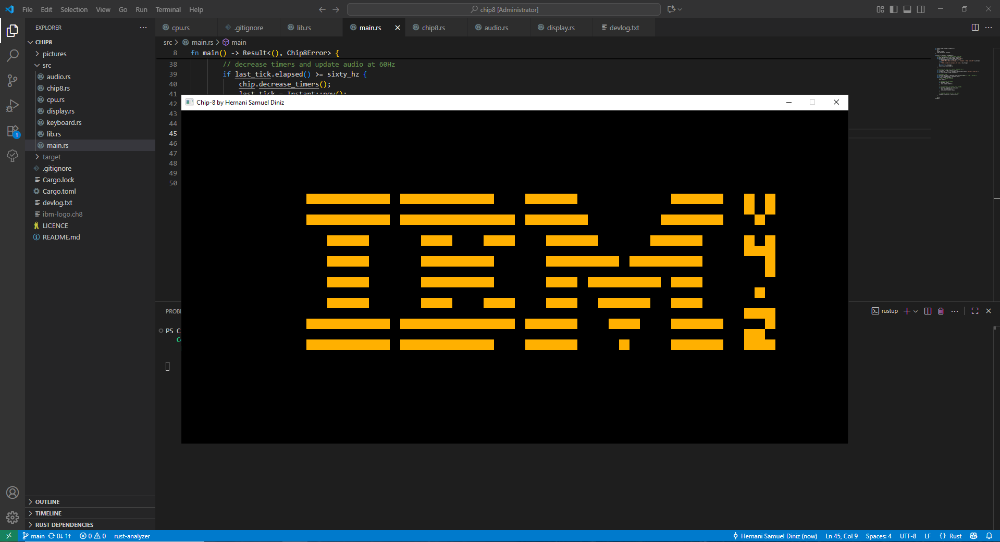

I'm making a chip8 emulator in rust for fun and learning.
The main goal is to understand how CPU and hardware works.
 
I hope I can describe all states and transitions of the system, architect and implement the solution in Rust in a way that makes it compatible with existent chip8 ROMs!   
First rom running! ibm-logo.ch8 (https://github.com/Timendus/chip8-test-suite/blob/main/README.md)  
